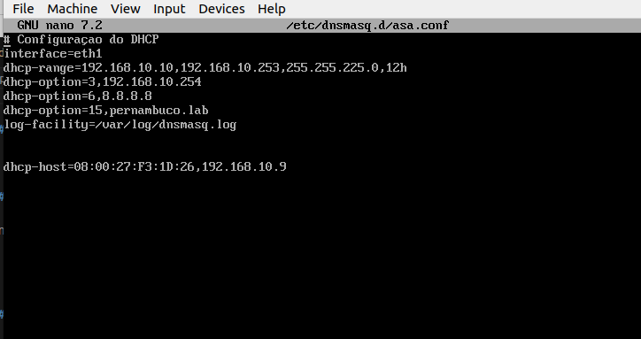
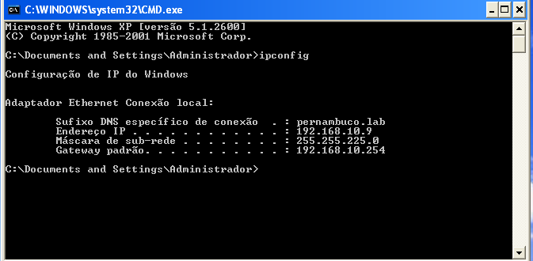
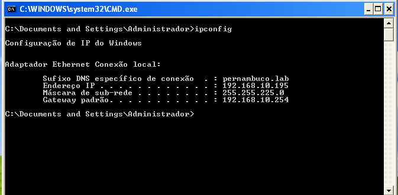

# DHCP

## Instalação

Você pode usar o atalho de teclado Ctrl + Alt + T no Ubuntu para abrir um terminal.

Digite o comando:

```
sudo apt update
sudo apt install dnsmasq
```

Inicie ou reinicie o serviço (se necessário):
      
```
sudo systemctl start dnsmasq
sudo systemctl enable dnsmasq
```

Estes comandos iniciam o serviço dnsmasq e o configuram para iniciar automaticamente durante a inicialização do sistema.

Com o Dns instalado e em execução na máquina, podomes configurar o arquivo ```/etc/dnsmasq.conf`````` para personalizar as opções de configuração conforme necessário.

## Configuração

Vamos precisar abrir o arquivo de configuração:

```
/etc/dnsmasq.d/asa.conf

```

Em seguida, vamos editar colocando as seguintes informações:

**Configuração do DHCP**

```

Interface=eth1
dhcp-range=192.168.10.10,192.168.10.253,255.255.0,12h
dhcp-option=3,192.168.10.254
dhcp-option=6,8.8.8.8
dhcp-option=15,pernambuco.lab
log-facility=/var/log/dnsmasq.log

dhcp-host=08:00:27:F3:1D:26,192.168.10.

```


**O resultado final do arquivo deve ser semelhante a esse:**




Vale lembrar que precisamos sempre reiniciar o serviço após cada alteração, abaixo vou listar
os comandos essenciais.


**Para startar o serviço:**

```
rc-service dnsmasq start
```

**Para reiniciar o serviço**

```
rc-service dnsmasq restart
```

**Para parar o serviço**

```
rc-service dnsmasq stop
```


## Teste

Após o arquivo DHCP configurado e ter certeza que o serviço está rodando, vamos configurar uma máquina com o windows Xp como exemplo.

**Vamos navegar até as configurações de rede da máquina(Conexão local) - Propriedades - Protocolo TCP/IP e ajustar os endereços do servidor DNS para:**

```
Servidor DNS prefencial: 192.168.10.254 - IP usado para consfigurar o arquivo: /etc/network/interfaces (o mesmo que roda o serviço DHCP)

Servidor DNS alternativo: 8.8.8.8 - DNS configurado no arquivo: /etc/dnsmasq.d/asa.conf

```


Rodando o comando ipconfig para confirmar a distribuição dos ips na máquina Clone windows.




Aqui podemos observar na máquina real que foi disponibilizado os ips configurado no arquivo de configuração:

`/etc/dnsmasq.d/asa`


