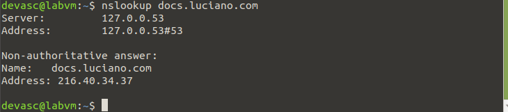

# DNS

## Instalação

Abra o terminal:

Abra o terminal no seu sistema. Isso geralmente pode ser feito procurando por "Terminal" no menu ou pressionando Ctrl + Alt + T.

Atualize a lista de pacotes:

Antes de instalar qualquer coisa, é uma boa prática atualizar a lista de pacotes disponíveis. Execute o seguinte comando:

```
sudo apt update
```

Instale o Dnsmasq:

Agora, instale o Dnsmasq com o seguinte comando:

```
sudo apt-get install dnsmasq
```

## Configuração

Abra o arquivo de configuração do Dnsmasq:

O arquivo de configuração do Dnsmasq geralmente está localizado em /etc/dnsmasq.conf. Você pode editá-lo usando um editor de texto, como o nano:

```
sudo nano /etc/dnsmasq.conf
```

**Adicione registros A e CNAME:**

Adicione as seguintes linhas ao arquivo para criar registros A e CNAME. Certifique-se de ajustar os valores conforme necessário.

```
# Registros do tipo A
# ex. Associa o domínio ao ip

address=/pernambuco.luciano.com/192.168.1.2
address=/pernambuco.luciano.com/192.168.1.3
address=/pernambuco.luciano.com/192.168.1.4

# Registros do tipo CNAME
# ex. Cria um registro CNAME associando o subdomínio ao domínio.
cname=www.luciano.com,luciano.com
cname=docs.luciano.com,documentation.luciano.com

Substitua luciano.com pelos seus próprios domínios e ajuste os endereços IP conforme necessário.
```

Reinicie o Dnsmasq:

Após fazer as alterações no arquivo de configuração, reinicie o Dnsmasq para aplicar as mudanças:

```
sudo service dnsmasq restart
```


# Teste

Verifique os registros:

Use ferramentas como nslookup ou dig para verificar se os registros são resolvidos corretamente. Por exemplo:

```
nslookup pernambuco.luciano.com
nslookup www.luciano.com
nslookup docs.luciano.com
```

Certifique-se de obter os endereços IP ou registros CNAME corretos em resposta.

ex. 

Nesse caso o ip no qual era pra ter retornado era o indicado no arquivo: **/etc/dnsmasq.conf**
