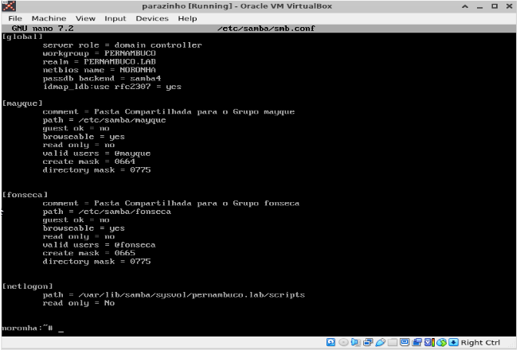
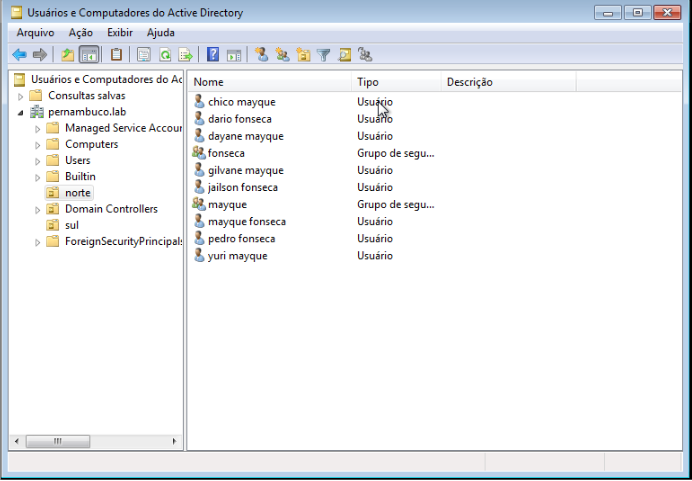
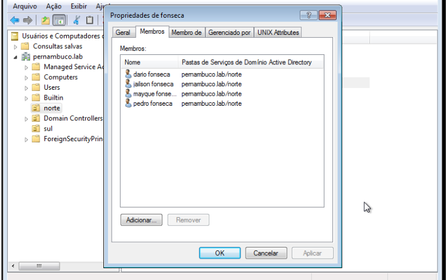

# LDAP

O LDAP (Lightweight Directory Access Protocol) é um protocolo de acesso a diretórios utilizado para consultar e manter informações de diretórios de maneira hierárquica. Aqui está um resumo conciso:

## Instalação

Use o gerenciador de pacotes da sua distribuição Linux, no meu caso, minha distro é Ubuntu.

```
sudo apt-get install slapd ldap-utils
```
Durante a instalação, você será solicitado a configurar a senha do administrador do LDAP (cn=admin,dc=example,dc=com). Forneça uma senha boa, que não seja tão comum.


O arquivo de Configuração Principal: 
```
/etc/ldap/slapd.conf ou similar - dependendo da sua distro.
```

Abra o arquivo de configuração principal para edição. Os caminhos e a estrutura do arquivo podem variar dependendo da versão do OpenLDAP.

```
sudo nano /etc/ldap/slapd.conf
```


## Configuração do serviço dentro do ambiente gráfico Windows 7.

Abra o "Active Directory":

Você pode usar esse atalho no seu teclado:

Pressione Win + R para abrir a caixa de diálogo "Executar".
Digite dsa.msc e pressione Enter.

Conecte-se ao Servidor do AD:

Selecione o nó ```"Domain Controllers"``` e escolha ```"Connect to Domain Controller..."``` no menu de contexto.
Selecione o controlador de domínio que deseja gerenciar e clique em "OK".

Crie as Organizational Units (OU):

No painel esquerdo, clique com o botão direito no domínio raiz e escolha ```"New"``` -> ```"Organizational Unit"```.
Digite o nome da OU, como "norte", e clique em "OK".
Repita o processo para criar a OU "sul".

Mova Grupos e Usuários para as Novas OUs:

Localize os grupos mayque e fonseca dentro da estrutura do AD.
Selecione os grupos ou usuários que deseja mover.
Clique com o botão direito do mouse e escolha "Move".
Navegue até a nova OU correspondente (norte ou sul) e clique em "OK".

## Teste

Entrar no arquivo: **/etc/samba/smb.conf**

Adicionar os grupos com os nomes: mayque, fonseca e adicionar linhas de configurações. Depois criar os usuários que é preciso dentro de cada grupo.



Tela da criação das OU, grupos e usuários.



Verificando os usuários dentro do grupo correspondente e movido pra sua OU.




