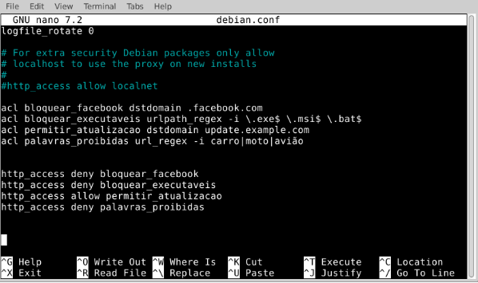
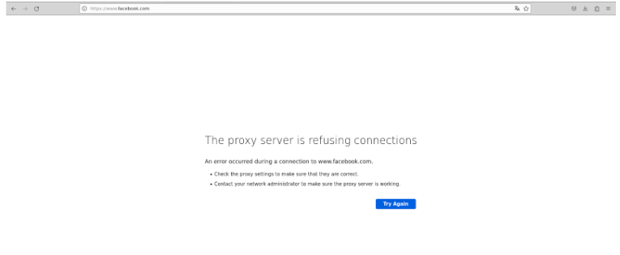
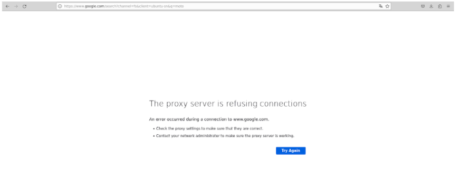

# PROXY

## Instalação do Proxy em um Ambiente Linux.
Abra o terminal:

Vá até o menu e procure por "Terminal" ou pressione Ctrl + Alt + T para abrir o terminal.
Atualize a lista de pacotes:


Antes de instalar qualquer coisa, é uma boa prática atualizar a lista de pacotes disponíveis. Digite o seguinte comando e pressione Enter:


```
sudo apt update

```


Momento onde você vai começar a instalação:

Agora, você está pronto para instalar o Squid. Digite o seguinte comando e pressione Enter:

```
sudo apt-get install squid

```

Confirme a instalação:

O terminal pode perguntar se você deseja continuar. Digite Y (sim) e pressione Enter.
Aguarde a conclusão da instalação:

O sistema começará a baixar e instalar o Squid. Aguarde até que o processo seja concluído.
Verifique a instalação (opcional):

Após a instalação, você pode verificar a versão do Squid para garantir que tudo correu bem. Digite o seguinte comando:

```
squid -v

```

Isso deverá exibir a versão do Squid instalada.
Inicie o Squid (se não iniciar automaticamente):

Dependendo da configuração do seu sistema, o Squid pode iniciar automaticamente após a instalação. Se não, você pode iniciar manualmente com o seguinte comando:

```
sudo service squid start

```

## Configuração

Abra o arquivo de configuração do Squid:

Normalmente, o arquivo de configuração do Squid está localizado em:


```
/etc/squid/squid.conf

```

Você pode editá-lo usando um editor de texto, como o nano. Digite o seguinte comando para abrir o arquivo:

```
sudo nano /etc/squid/squid.conf
```

Adicione as ACLs:

No arquivo de configuração, você pode adicionar as ACLs no final ou em uma seção específica, dependendo de como o arquivo está organizado. Adicione as seguintes linhas para criar 4 ACLs simples:

```
# ACL para bloquear o facebook
acl bloquear_facebook dstdomain .facebook.com

# ACL para bloquear executaveis
acl bloquear_executaveis urlpath_reges -i \.exe$ \.msi$ \.bat$

# ACL para permitir atualização
acl permitir_atualização dstdomain update.example.com

# ACL para proibir palavras
acl palavras_proibidas url_regex -i carro moto aviao

```
Lembre-se de ajustar os valores dessas ACLs conforme necessário para atender aos seus requisitos.

Configure as regras de acesso:

Depois de criar as ACLs, você pode configurar as regras de acesso. Adicione as seguintes linhas para permitir ou negar o acesso com base nas ACLs criadas:

```
Regra para  bloquear o facebook
http_access deny bloquear_facebook

Regra para bloquear executaveis
http_access deny bloquear_executaveis

Regra para permitir permitir atualização
http_access allow permitir_atualizacao

Regra para proibir palavras
http_access deny palavras_proibidas

Regra padrão (ao final do arquivo) para negar acesso não permitido

```
```
http_access deny all
```

Essas regras são apenas exemplos. Você pode personalizá-las de acordo com suas necessidades específicas.

Salve e saia:

No editor de texto (nano), pressione Ctrl + X para sair, confirme se deseja salvar as alterações, pressionando Y, e pressione Enter.
Reinicie o Squid:

Após fazer as alterações no arquivo de configuração, reinicie o Squid para aplicar as mudanças. Utilize o seguinte comando:

```
sudo service squid restart
```
## Teste

Após fazer todos os passos anterior, vamos ver como ficou os testes:

 - Foi criado uma cópia do arquivo: /etc/squid/squid.conf. Para ser editado sem perder os dados do arquivo principal.

 - Foi adicionado todas as acls e as regras.

# Imagem do arquivo de configuração




Nas imagens seguintes, vimos o Navegador configurado e recusando acessos que foi inseridos no arquivo de configuração.

1 - Recusado acesso ao: facebook.com


1.1 - Recusado pesquisa com a palavra: moto
# Imagem 1



# Imagem 1.1
